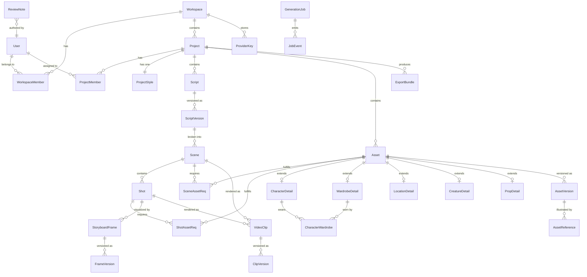

# Data Model

AI AssemblyLine stores structured project, asset, scene, shot, and generation metadata in Postgres via Prisma. This document defines the entity relationships, cardinalities, and the asset-type modeling strategy.

## Asset-type modeling decision

The Asset Bible defines five distinct asset types (Character, Wardrobe, Location, Creature/Animal, Close-up Prop), each with different field sets. The data model uses a **base-plus-extension** approach:

- A shared `Asset` table holds fields common to every asset: project link, canonical name, type discriminator, lifecycle status, and creation metadata.
- Each asset type has a dedicated extension table (`CharacterDetail`, `WardrobeDetail`, `LocationDetail`, `CreatureDetail`, `PropDetail`) that stores type-specific fields and has a one-to-one foreign key back to `Asset`.
- All cross-cutting relationships (scene requirements, shot requirements, asset versions, references) join to the base `Asset` table so queries stay simple.
- Type-specific queries join through the extension table for full field access.

This gives type safety for each asset category while keeping dependency tracking, versioning, and approval logic on a single base entity.

## Entity relationship diagram

## Core entities

### User

| Field | Type | Notes |
|-------|------|-------|
| id | UUID | PK |
| email | string | unique |
| name | string | display name |
| avatarUrl | string? | optional |
| createdAt | timestamp | |
| updatedAt | timestamp | |

### Workspace

| Field | Type | Notes |
|-------|------|-------|
| id | UUID | PK |
| name | string | |
| slug | string | unique, URL-safe |
| createdAt | timestamp | |
| updatedAt | timestamp | |

### WorkspaceMember

| Field | Type | Notes |
|-------|------|-------|
| id | UUID | PK |
| workspaceId | UUID | FK → Workspace |
| userId | UUID | FK → User |
| role | enum | `owner`, `admin`, `member` |
| joinedAt | timestamp | |

Unique constraint on (workspaceId, userId).

### Project

| Field | Type | Notes |
|-------|------|-------|
| id | UUID | PK |
| workspaceId | UUID | FK → Workspace |
| title | string | |
| targetFormat | string | e.g. "short_film", "pilot" |
| aspectRatio | string | e.g. "16:9", "2.39:1" |
| estimatedRuntime | int? | seconds |
| storagePath | string | local filesystem root |
| rightsPolicy | enum | `unrestricted`, `no_real_people`, `client_owned`, `custom` |
| createdAt | timestamp | |
| updatedAt | timestamp | |

### ProjectMember

| Field | Type | Notes |
|-------|------|-------|
| id | UUID | PK |
| projectId | UUID | FK → Project |
| userId | UUID | FK → User |
| role | enum | `owner`, `producer`, `artist`, `reviewer`, `viewer` |
| joinedAt | timestamp | |

Unique constraint on (projectId, userId).

### ProjectStyle

One-to-one with Project.

| Field | Type | Notes |
|-------|------|-------|
| id | UUID | PK |
| projectId | UUID | FK → Project, unique |
| styleName | string | |
| description | text | canonical style description |
| colorPalette | JSON | array of hex/HSL values |
| lightingRules | text | |
| renderingMedium | string | e.g. "digital painting", "3D render" |
| lensLanguage | text | camera/lens conventions |
| negativeConstraints | text | things to avoid |
| modelPromptFragments | JSON | provider → fragment map |
| approvalStatus | enum | `draft`, `approved`, `locked` |
| createdAt | timestamp | |
| updatedAt | timestamp | |

### ProviderKey

| Field | Type | Notes |
|-------|------|-------|
| id | UUID | PK |
| workspaceId | UUID | FK → Workspace |
| providerSlug | string | e.g. "openai", "runway" |
| encryptedKey | bytes | AES-256-GCM encrypted |
| keyNonce | bytes | encryption nonce |
| label | string? | user-friendly label |
| createdAt | timestamp | |
| updatedAt | timestamp | |

### Script

| Field | Type | Notes |
|-------|------|-------|
| id | UUID | PK |
| projectId | UUID | FK → Project |
| filename | string | original upload name |
| createdAt | timestamp | |

### ScriptVersion

| Field | Type | Notes |
|-------|------|-------|
| id | UUID | PK |
| scriptId | UUID | FK → Script |
| versionNumber | int | monotonic |
| filePath | string | local path to raw file |
| analysisStatus | enum | `pending`, `running`, `complete`, `failed` |
| isActive | boolean | only one active version per script |
| createdAt | timestamp | |

When a new ScriptVersion is uploaded mid-production, the system creates new Scene/Shot records linked to the new version. Existing scenes and shots from the previous version are preserved with their storyboards and clips but marked `superseded`. Asset links carry forward automatically; users resolve conflicts through the asset-requirement editor.

### Scene

| Field | Type | Notes |
|-------|------|-------|
| id | UUID | PK |
| scriptVersionId | UUID | FK → ScriptVersion |
| sceneNumber | int | ordering |
| heading | string | slug line / scene heading |
| summary | text | AI-generated or user-edited |
| scriptStartLine | int | |
| scriptEndLine | int | |
| locationHint | string? | detected location name |
| status | enum | `blocked`, `ready`, `in_progress`, `complete` |
| createdAt | timestamp | |
| updatedAt | timestamp | |

### Shot

| Field | Type | Notes |
|-------|------|-------|
| id | UUID | PK |
| sceneId | UUID | FK → Scene |
| shotNumber | int | ordering within scene |
| action | text | what happens |
| cameraAngle | string? | e.g. "wide", "close-up" |
| cameraMovement | string? | e.g. "dolly in", "static" |
| lensNotes | text? | |
| lightingNotes | text? | |
| userDirection | text? | |
| status | enum | `blocked`, `ready`, `storyboarded`, `video_ready`, `complete` |
| createdAt | timestamp | |
| updatedAt | timestamp | |

### Asset

Base table for all asset types.

| Field | Type | Notes |
|-------|------|-------|
| id | UUID | PK |
| projectId | UUID | FK → Project |
| type | enum | `character`, `wardrobe`, `location`, `creature`, `prop` |
| canonicalName | string | |
| aliases | JSON | string array |
| status | enum | `missing`, `draft`, `needs_review`, `approved`, `locked`, `superseded`, `rejected` |
| continuityNotes | text? | |
| negativePrompts | text? | |
| createdAt | timestamp | |
| updatedAt | timestamp | |

### CharacterDetail

| Field | Type | Notes |
|-------|------|-------|
| id | UUID | PK |
| assetId | UUID | FK → Asset, unique |
| role | string | e.g. "protagonist", "supporting" |
| narrativeDescription | text | |
| physicalDescription | text | |
| personalityNotes | text? | |
| performanceNotes | text? | |
| scaleReference | text? | |

### WardrobeDetail

| Field | Type | Notes |
|-------|------|-------|
| id | UUID | PK |
| assetId | UUID | FK → Asset, unique |
| outfitName | string | |
| storyContext | text | |
| materialNotes | text? | |
| accessories | JSON | string array |
| colorPalette | JSON | hex/HSL array |

### CharacterWardrobe

Many-to-many join between CharacterDetail and WardrobeDetail.

| Field | Type | Notes |
|-------|------|-------|
| characterDetailId | UUID | FK → CharacterDetail |
| wardrobeDetailId | UUID | FK → WardrobeDetail |

Composite PK on (characterDetailId, wardrobeDetailId).

### LocationDetail

| Field | Type | Notes |
|-------|------|-------|
| id | UUID | PK |
| assetId | UUID | FK → Asset, unique |
| floorPlanNotes | text? | |
| entranceExitNotes | text? | |
| setDressing | text? | |
| lightingStates | JSON? | array of lighting configs |
| cameraSafeZones | text? | |

### CreatureDetail

| Field | Type | Notes |
|-------|------|-------|
| id | UUID | PK |
| assetId | UUID | FK → Asset, unique |
| speciesType | string | |
| anatomyNotes | text? | |
| scaleReference | text? | |
| movementNotes | text? | |
| textureDetails | text? | |

### PropDetail

| Field | Type | Notes |
|-------|------|-------|
| id | UUID | PK |
| assetId | UUID | FK → Asset, unique |
| ownerOrScene | string? | |
| materialAndWear | text? | |
| scaleReference | text? | |
| interactionNotes | text? | |

### AssetVersion

| Field | Type | Notes |
|-------|------|-------|
| id | UUID | PK |
| assetId | UUID | FK → Asset |
| versionNumber | int | monotonic per asset |
| description | text? | what changed |
| promptFragments | JSON? | provider → fragment map |
| status | enum | `draft`, `needs_review`, `approved`, `rejected`, `superseded` |
| createdAt | timestamp | |

### AssetReference

A media file (uploaded or generated) attached to an asset version.

| Field | Type | Notes |
|-------|------|-------|
| id | UUID | PK |
| assetVersionId | UUID | FK → AssetVersion |
| referenceType | enum | `front`, `side`, `back`, `expression_sheet`, `pose_sheet`, `scale`, `turnaround`, `detail`, `other` |
| filePath | string | local filesystem path |
| mimeType | string | |
| width | int? | pixels |
| height | int? | pixels |
| thumbnailPath | string? | |
| generationJobId | UUID? | FK → GenerationJob, if AI-generated |
| createdAt | timestamp | |

### SceneAssetReq / ShotAssetReq

Join tables linking scenes and shots to their required assets.

| Field | Type | Notes |
|-------|------|-------|
| id | UUID | PK |
| sceneId / shotId | UUID | FK → Scene or Shot |
| assetId | UUID | FK → Asset |
| isOptional | boolean | default false |
| detectedBy | enum | `ai`, `user` |
| createdAt | timestamp | |

### StoryboardFrame

| Field | Type | Notes |
|-------|------|-------|
| id | UUID | PK |
| shotId | UUID | FK → Shot |
| keyframeIndex | int | 0–8, ordering within shot |
| sketchFilePath | string? | user-uploaded sketch |
| createdAt | timestamp | |
| updatedAt | timestamp | |

### FrameVersion

| Field | Type | Notes |
|-------|------|-------|
| id | UUID | PK |
| frameId | UUID | FK → StoryboardFrame |
| versionNumber | int | monotonic per frame |
| prompt | text | composed generation prompt |
| filePath | string | generated image path |
| thumbnailPath | string? | |
| status | enum | `draft`, `needs_review`, `approved`, `rejected`, `superseded` |
| generationJobId | UUID? | FK → GenerationJob |
| createdAt | timestamp | |

When a new FrameVersion is approved, any VideoClipVersions that referenced the previous frame version are marked `stale`. Users see a warning and can regenerate affected clips.

### VideoClip

| Field | Type | Notes |
|-------|------|-------|
| id | UUID | PK |
| shotId | UUID? | FK → Shot (shot-by-shot mode) |
| sceneId | UUID? | FK → Scene (scene-level mode) |
| createdAt | timestamp | |
| updatedAt | timestamp | |

Exactly one of shotId or sceneId must be set.

### ClipVersion

| Field | Type | Notes |
|-------|------|-------|
| id | UUID | PK |
| clipId | UUID | FK → VideoClip |
| versionNumber | int | monotonic per clip |
| prompt | text | composed generation prompt |
| filePath | string | video file path |
| thumbnailPath | string? | |
| durationMs | int | |
| status | enum | `draft`, `needs_review`, `approved`, `rejected`, `superseded`, `stale` |
| sourceFrameVersionIds | JSON | array of FrameVersion IDs used |
| generationJobId | UUID? | FK → GenerationJob |
| createdAt | timestamp | |

### GenerationJob

| Field | Type | Notes |
|-------|------|-------|
| id | UUID | PK |
| projectId | UUID | FK → Project |
| type | enum | `script_analysis`, `asset_reference`, `storyboard_frame`, `video_clip`, `export`, `import`, `thumbnail`, `media_convert` |
| providerSlug | string? | null for internal jobs |
| modelId | string? | |
| status | enum | `queued`, `running`, `provider_submitted`, `polling`, `processing_output`, `complete`, `failed`, `canceled` |
| inputPayload | JSON | prompt, settings, references |
| outputPayload | JSON? | result metadata |
| errorMessage | text? | |
| errorClass | enum? | `retriable`, `fatal`, `content_policy`, `rate_limit`, `timeout` |
| retryCount | int | default 0 |
| estimatedCostUnits | float? | provider-reported usage |
| actualCostUnits | float? | provider-reported usage |
| costCurrency | string? | e.g. "USD" |
| providerJobId | string? | external ID for polling |
| startedAt | timestamp? | |
| completedAt | timestamp? | |
| createdAt | timestamp | |

### JobEvent

Real-time progress events emitted by generation jobs.

| Field | Type | Notes |
|-------|------|-------|
| id | UUID | PK |
| jobId | UUID | FK → GenerationJob |
| eventType | string | e.g. "progress", "status_change", "error" |
| message | string? | human-readable |
| progressPct | int? | 0–100 |
| createdAt | timestamp | |

### ReviewNote

| Field | Type | Notes |
|-------|------|-------|
| id | UUID | PK |
| projectId | UUID | FK → Project |
| authorId | UUID | FK → User |
| targetType | enum | `asset_version`, `frame_version`, `clip_version` |
| targetId | UUID | polymorphic FK |
| parentNoteId | UUID? | FK → ReviewNote for threading |
| body | text | comment content |
| markupFilePath | string? | annotated image |
| status | enum | `open`, `resolved`, `dismissed` |
| createdAt | timestamp | |
| updatedAt | timestamp | |

### ExportBundle

| Field | Type | Notes |
|-------|------|-------|
| id | UUID | PK |
| projectId | UUID | FK → Project |
| bundleVersion | int | schema version for forward compat |
| manifestPath | string | path to manifest JSON |
| archivePath | string | path to zip/tar |
| generationJobId | UUID? | FK → GenerationJob |
| createdAt | timestamp | |

## Key relationship cardinalities

| Relationship | Cardinality |
|-------------|-------------|
| Workspace → Projects | 1 : N |
| Project → Scripts | 1 : N (usually 1) |
| Script → ScriptVersions | 1 : N |
| ScriptVersion → Scenes | 1 : N |
| Scene → Shots | 1 : N |
| Project → Assets | 1 : N |
| Asset → AssetVersions | 1 : N |
| AssetVersion → AssetReferences | 1 : N |
| Asset → CharacterDetail | 1 : 0..1 |
| Character → Wardrobes | M : N (via CharacterWardrobe) |
| Scene → Assets (required) | M : N (via SceneAssetReq) |
| Shot → Assets (required) | M : N (via ShotAssetReq) |
| Shot → StoryboardFrames | 1 : 1..9 |
| StoryboardFrame → FrameVersions | 1 : N |
| Shot → VideoClips | 1 : N |
| Scene → VideoClips | 1 : N |
| VideoClip → ClipVersions | 1 : N |
| Project → GenerationJobs | 1 : N |

## Cascading staleness rules

1. **Style change:** When ProjectStyle approval status moves from `locked` to `draft` or a locked style is edited, all FrameVersions with status `approved` gain a `stale` flag. All ClipVersions referencing those frames are also marked `stale`. Users see dashboard warnings.

2. **Asset version superseded:** When a new AssetVersion is approved on an Asset, any FrameVersions for shots requiring that asset are marked `stale`. Downstream ClipVersions are also marked `stale`.

3. **Frame version superseded:** When a new FrameVersion is approved, ClipVersions referencing the old frame version are marked `stale`.

4. **Script re-analysis:** A new ScriptVersion creates fresh Scene/Shot records. Previous version's scenes and shots are marked `superseded` but their storyboards and clips are preserved for reference.

Users may dismiss staleness warnings and keep existing frames or clips if the visual difference is acceptable.
