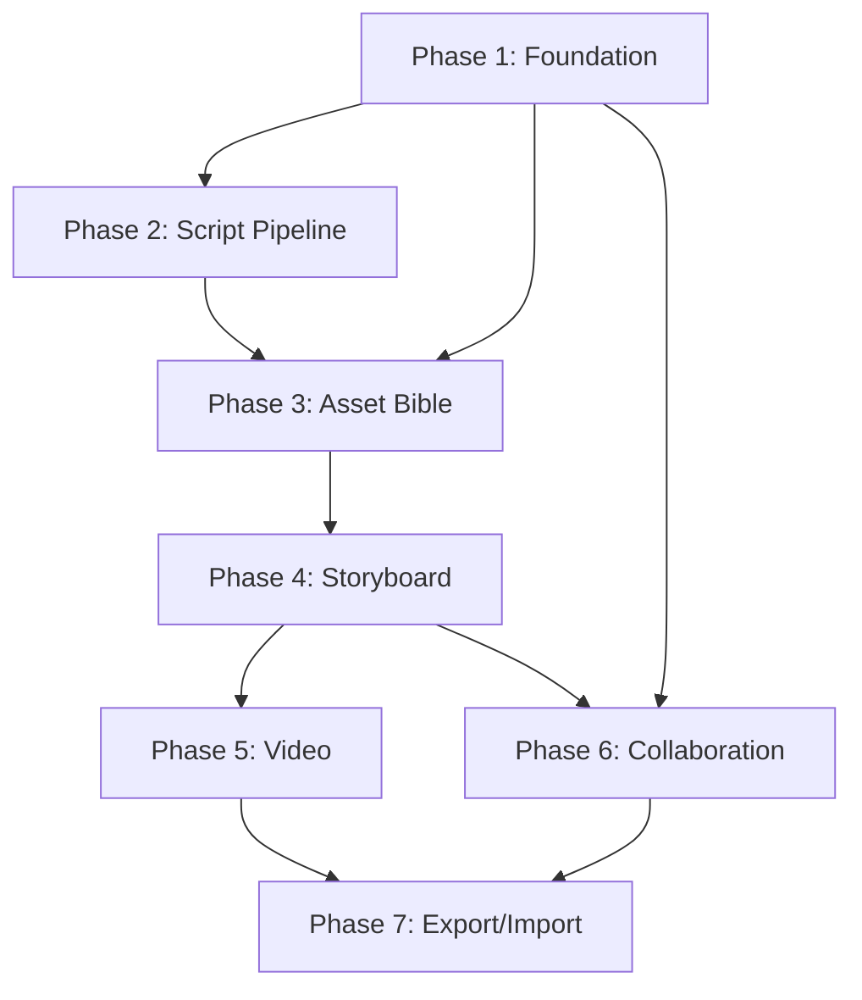

# Implementation Roadmap

This document defines the build order for AI AssemblyLine. The full scope is preserved; phases exist to manage dependencies (not to cut features). Each phase builds on the previous and produces a testable, runnable state.

## Dependency graph

## Phase 1 — Foundation

**Goal:** Runnable app shell with auth, data layer, provider framework, job queue, and real-time events.

| Deliverable | Details |
|-------------|---------|
| Next.js project scaffold | App router, TypeScript, ESLint, Prettier |
| Prisma schema | All entities from [data-model.md](data-model.md) |
| Database setup | Postgres with initial migration |
| Auth | NextAuth with credentials + OAuth, session management |
| RBAC middleware | `requireAuth`, `requireWorkspaceRole`, `requireProjectRole` |
| Provider adapter framework | Base interfaces for text, image, video categories. One concrete adapter (OpenAI) |
| API key management | Encrypted storage, server-side-only decryption |
| BullMQ + Redis setup | Queue creation, worker scaffold, retry policy |
| SSE endpoint | Real-time job event stream per project |
| Local filesystem storage | Directory structure, path helpers, thumbnail stub |
| Project CRUD | Create, read, update, delete projects and workspaces |
| UI shell | Dashboard layout, navigation, project list, settings pages |
| Testing scaffold | Vitest config, provider mock factory, first smoke tests |

**Exit criteria:** A user can sign in, create a workspace and project, configure an OpenAI API key, and see an empty project dashboard with live SSE connection.

## Phase 2 — Script Pipeline

**Goal:** Upload a script and get an editable scene/shot/asset breakdown.

| Deliverable | Details |
|-------------|---------|
| Script upload endpoint | File upload, ScriptVersion creation, local storage |
| Analysis job | Multi-pass LLM pipeline per [script-analysis.md](script-analysis.md) |
| Scene/shot extraction | Pass 1 + Pass 2 with chunking and validation |
| Asset detection | Pass 3 with deduplication and fuzzy matching |
| Analysis UI | Scene list, shot list, asset list with edit/merge/delete/add controls |
| Requirement editor | Scene ↔ asset and shot ↔ asset links with real-time dependency graph |
| Re-analysis | Per-scene and full-script re-analysis with user-edit preservation |
| Script versioning | Upload new revision, carry forward assets, mark old scenes superseded |
| Job progress | Real-time SSE updates during analysis |

**Exit criteria:** A user can upload a script, see the analysis run with live progress, review the AI-detected breakdown, make edits, and see the asset requirement graph.

## Phase 3 — Asset Bible

**Goal:** Full asset lifecycle with uploads, generation, versioning, and approval.

| Deliverable | Details |
|-------------|---------|
| Asset Bible UI | Per-type editors (character, wardrobe, location, creature, prop) with all fields from [asset-bible.md](asset-bible.md) |
| Reference upload | Multi-image upload per asset version, file validation, thumbnail generation |
| On-request generation | Image generation job for missing reference sheets using the image adapter |
| Asset versioning | Create new versions, compare side-by-side, approve/reject/supersede |
| Asset lifecycle | Full status transitions with warnings on lock/unlock |
| Merge/split | Merge duplicate assets, split incorrectly merged assets |
| Dependency tracking | Scene/shot status updates when required assets are approved |
| Second image adapter | Stability or Replicate adapter for image generation variety |
| ProjectStyle editor | Style record creation, editing, locking, with regeneration warnings |

**Exit criteria:** A user can build an Asset Bible with uploaded and generated references, approve assets, and see scenes/shots unlock as their requirements are fulfilled.

## Phase 4 — Storyboard

**Goal:** Generate, edit, and approve storyboard frames with drawing tools.

| Deliverable | Details |
|-------------|---------|
| Storyboard generation | Prompt composition from style + script + shot + assets + user direction per [prompt-engine.md](prompt-engine.md) |
| Multi-keyframe support | 1–9 keyframes per shot with ordering |
| Frame versioning | Generate, regenerate, version, approve/reject/supersede |
| Sketch ingestion | Upload sketch storyboards as composition guides with failure handling |
| Storyboard editor | Prompt refinement, variation, comparison, approval, rejection |
| Drawing tools | Annotation layer using tldraw or Fabric.js: arrows, rectangles, text, freehand, color picker, undo/redo |
| Markup tools | Overlay markup on frames for review notes |
| Frame-level review | Threaded comments on individual frames |
| Staleness | Warnings when upstream assets or style changes invalidate approved frames |
| Prompt engine | Template system, conflict resolution, truncation, provider translation per [prompt-engine.md](prompt-engine.md) |

**Exit criteria:** A user can generate storyboard frames for unlocked shots, iterate with prompt changes and drawing markup, approve frames, and see staleness warnings when assets change.

## Phase 5 — Video Generation

**Goal:** Produce video clips from approved storyboard frames.

| Deliverable | Details |
|-------------|---------|
| Shot-by-shot generation | Video clips from approved frame versions + shot metadata |
| Scene-level generation | Optional mode using scene summary + all shot frames |
| Video prompt composition | Extension of prompt engine for video providers |
| Clip versioning | Generate, regenerate, version, approve/reject with staleness from frame changes |
| Video adapters | At least two video provider adapters (e.g. Runway, Kling) |
| Async polling | Provider job polling with configurable intervals per [job-queue-design.md](job-queue-design.md) |
| Clip review | Threaded comments on clips, approval workflow |
| FFmpeg integration | Thumbnail extraction, format conversion, clip info per [media-processing.md](media-processing.md) |

**Exit criteria:** A user can generate video clips in shot-by-shot and scene-level modes, review and approve clips, and see real-time progress for async provider jobs.

## Phase 6 — Collaboration

**Goal:** Multi-user team production with roles, assignments, and review workflow.

| Deliverable | Details |
|-------------|---------|
| Invitation flow | Email invitations with signed tokens per [auth-and-access.md](auth-and-access.md) |
| Member management | Add/remove workspace and project members, role assignment |
| Role enforcement | Full permission matrix enforcement across all endpoints |
| Assignments | Assign scenes, shots, or assets to specific team members |
| Activity feed | Project-level activity log showing generation, approval, comment, and edit events |
| Review workflow | Status filters, approval history, batch approval |
| Locked asset warnings | Warn when an artist attempts to edit a locked asset |
| Multi-user SSE | Per-user event filtering on the project SSE stream |

**Exit criteria:** A team of 2+ users can collaborate on a project with proper role enforcement, assignments, review comments, and activity tracking.

## Phase 7 — Export, Import, and Polish

**Goal:** Complete project portability and production polish.

| Deliverable | Details |
|-------------|---------|
| Export bundle | Full project bundle per [data-and-collaboration.md](data-and-collaboration.md) with manifest, media, metadata |
| Import | Parse and restore exported bundles into new projects |
| Bundle versioning | Schema version field for forward compatibility |
| Remaining adapters | ByteDance/Seedance, Pika, Luma, ElevenLabs adapters |
| Observability | Structured logging, error tracking (Sentry), job metrics dashboard |
| Storage management | Disk usage warnings, orphan cleanup, thumbnail cache management |
| Performance | Query optimization for large projects, pagination, lazy loading |
| Accessibility | Keyboard navigation, ARIA labels, screen-reader basics for core workflows |
| Documentation | Final user-facing docs, API reference, setup guide |

**Exit criteria:** A user can export a complete project, import it on a fresh instance, and the app handles large projects with proper observability and error tracking.

## Cross-phase concerns

These are addressed incrementally across all phases:

| Concern | Approach |
|---------|----------|
| Testing | Each phase adds unit tests for new service logic, integration tests for API routes, and E2E tests for critical user flows. Provider adapters use mock factories. See [testing-strategy.md](testing-strategy.md). |
| Documentation | Each feature is documented as part of the implementing change. README and user-facing docs update incrementally. |
| Error handling | Each phase implements error classification (retriable, fatal, content_policy, rate_limit, timeout) for its job types. |
| Migrations | Each phase runs `prisma migrate` for schema changes. Bundle import handles version differences via the `bundleVersion` field. |
