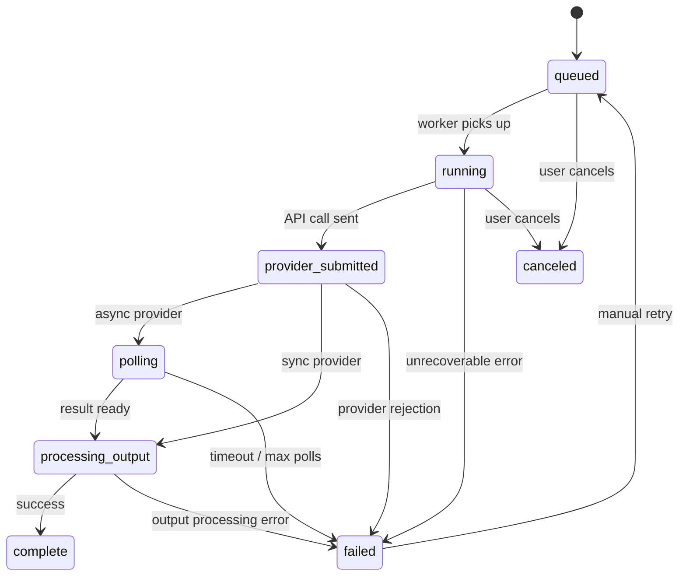

# Job Queue Design

AI AssemblyLine uses BullMQ backed by Redis for long-running AI generation jobs and internal processing tasks. This document defines the queue topology, concurrency, retry policy, and real-time event publishing.

## Queue topology

Separate queues per job category prevent slow video jobs from starving fast image jobs.

| Queue | Job types | Default concurrency |
|-------|-----------|-------------------|
| `analysis` | `script_analysis` | 2 |
| `image` | `asset_reference`, `storyboard_frame` | 3 |
| `video` | `video_clip` | 2 |
| `media` | `thumbnail`, `media_convert` | 4 |
| `project` | `export`, `import` | 1 |

Concurrency values are per-worker-process defaults. They can be adjusted via environment variables.

## Priority lanes

Each queue supports three priority levels:

| Priority | Value | Use case |
|----------|-------|----------|
| High | 1 | User-initiated regeneration of a rejected frame or clip |
| Normal | 5 | Standard generation requests |
| Low | 10 | Batch operations, thumbnail backfill |

## Retry and back-off policy

| Error class | Max retries | Back-off | Notes |
|-------------|-------------|----------|-------|
| `retriable` | 3 | Exponential: 30s, 2min, 8min | Provider temporary errors, network failures |
| `rate_limit` | 5 | Exponential: 60s, 5min, 20min, 60min, 120min | Provider rate limit responses (429) |
| `timeout` | 2 | Fixed: 60s | Provider did not respond within the expected window |
| `content_policy` | 0 | None | Provider rejected the content. No retry; surface to user immediately |
| `fatal` | 0 | None | Unrecoverable errors (invalid API key, malformed request) |

After max retries are exhausted, BullMQ retains the failed job in that queue's failed-job set and the AssemblyLine `GenerationJob` status becomes `failed`.

Worker processors also persist AssemblyLine job failures before rethrowing to BullMQ. If a processor throws after a `GenerationJob` has been created, the worker marks that GenerationJob `failed`, stores the failure message and error class, emits a final project job event, and then lets BullMQ apply the configured retry/dead-letter behavior.

## Failed-job retention

Each queue retains recent failed BullMQ jobs for debugging. Queue health responses include active, waiting, delayed, completed, failed counts, and up to 10 recent failed jobs with the job id, job name, failure reason, attempt count, and finish timestamp.

Failed AssemblyLine `GenerationJob` records are also persisted in Postgres with their error message, error class, and retry count so project owners can inspect failures in the operations panel. Manual retry/dismiss controls are not currently exposed; rerun the relevant workflow action to create a new job.

## Job lifecycle



## Async provider flow

Some providers (Runway, Kling, Pika) require asynchronous job submission and polling.

### Submission

1. The BullMQ worker sends the generation request to the provider API.
2. The provider returns an external job ID.
3. The worker stores `providerJobId` on the GenerationJob record and sets status to `provider_submitted`.
4. The worker emits a `provider_submitted` JobEvent.

### Polling

1. A dedicated **poll scheduler** (separate BullMQ repeatable job) runs every 15 seconds per queue.
2. It queries all GenerationJobs in `provider_submitted` or `polling` status.
3. For each, it calls the provider's status endpoint.
4. If the result is ready, it downloads the output and transitions to `processing_output`.
5. If still pending, it increments a poll counter and emits a `polling` JobEvent with progress if available.

### Polling limits

| Setting | Default |
|---------|---------|
| Poll interval | 15 seconds |
| Max poll duration | 30 minutes |
| Max poll attempts | 120 (30min ÷ 15s) |

If max polls are exceeded, the job transitions to `failed` with error class `timeout`.

### Webhook support

When a provider supports webhooks:

1. On job submission, the adapter registers a webhook callback URL pointing to `/api/webhooks/{providerSlug}`.
2. The webhook endpoint validates the request signature, matches the `providerJobId`, and transitions the job to `processing_output`.
3. The poll scheduler skips jobs with `webhookRegistered: true` unless they have been waiting longer than the max poll duration (fallback polling).

Webhook endpoints must validate provider-specific signatures to prevent spoofing.

## Real-time event publishing

Job events are broadcast to connected clients via **Server-Sent Events (SSE)**.

### SSE endpoint

`GET /api/projects/{projectId}/events`

- Requires authentication and project membership.
- Streams `JobEvent` records as they are created.
- Each event is a JSON object with `jobId`, `eventType`, `message`, `progressPct`, and `timestamp`.
- The connection sends a heartbeat ping every 30 seconds to keep the connection alive.

### Event publishing flow

1. BullMQ workers create `JobEvent` records in the database.
2. After writing, the worker publishes the event to a Redis pub/sub channel: `project:{projectId}:events`.
3. The SSE endpoint subscribes to the Redis channel and forwards events to connected clients.
4. Clients receive events and update job status in the UI in real time.

In automated tests, set `NODE_ENV=test` or `QUEUE_MODE=inline` to avoid opening Redis sockets. Production and production-like staging should leave `QUEUE_MODE` unset so BullMQ submission and Redis pub/sub are active.

### Client reconnection

If the SSE connection drops, the client reconnects with a `Last-Event-ID` header. The server replays missed events from the database since that event ID.

## Concurrency and rate-limit coordination

To avoid hitting provider rate limits across multiple concurrent jobs:

1. Each provider adapter declares its rate limit (requests per minute).
2. The queue worker uses a **BullMQ rate limiter** on the queue, configured per provider.
3. If a provider returns a 429, the job enters `rate_limit` error class and the queue pauses for the `Retry-After` duration (or a default of 60 seconds).

## Worker deployment

Workers run as separate Node.js processes alongside the Next.js app. Start them with:

```bash
npm run worker
```

With `QUEUE_MODE=inline`, script analysis, asset reference generation, storyboard frame generation, video clip generation, media utility jobs, and project export/import run synchronously and no Redis sockets are opened. With `QUEUE_MODE=redis` or production defaults, script upload and re-analysis create `script_analysis` jobs on the `assemblyline-analysis` BullMQ queue, Asset Bible reference generation creates `asset_reference` jobs and storyboard generation creates `storyboard_frame` jobs on the `assemblyline-image` queue, video generation creates `video_clip` jobs on the `assemblyline-video` queue, media utility jobs create `thumbnail` and `media_convert` jobs on the `assemblyline-media` queue, and project export/import creates `export` and `import` jobs on the `assemblyline-project` queue. The worker process consumes those jobs and writes progress events.

Current implementation status: `script_analysis`, `asset_reference`, `storyboard_frame`, `video_clip`, `thumbnail`, `media_convert`, `export`, and `import` have executable BullMQ worker processors. Runway video jobs can be submitted to the live provider and finalized by the Runway result processor after polling a completed task. In Redis queue mode, the worker registers a repeatable `provider_poll` job on the video queue every 15 seconds; that job queries `provider_submitted` and `polling` Runway video jobs from the repository and invokes the result processor. Media utility jobs require `ffmpeg` on `PATH`; `media_convert` writes the requested output file and then probes it for metadata, while `thumbnail` extracts a still frame to the requested output path.

Each worker process:

1. Connects to Redis.
2. Registers processors for its assigned queue(s).
3. Loads provider adapters and decrypts API keys on demand.
4. Writes output files to local filesystem storage.
5. Updates GenerationJob records in Postgres.
6. Publishes events to Redis pub/sub.
